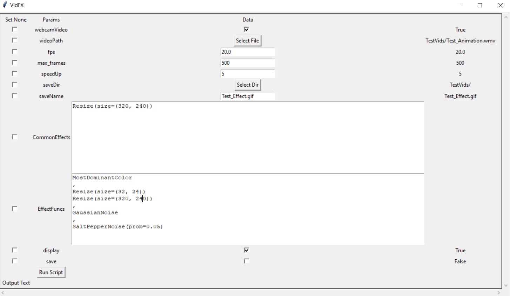

# VidFX
 A python tool (UI and Code) for editing videos and adding fun effects to webcam and video

# UI Effects Visualiser
   
   - Run VidFXUI.py file
   
     View effects easily for webcam or any video

     

     

# Effects

   - Run FrameVid.py file
   
     Add Frames to webcam or any video

     

   - Many Fun Effects including greyscale, binarise, dominant and least dominant channel, etc
   
   - Effects can also be used in combination with each other

     

   - Multiple Effects can be viewed at same time

     
