# VidFX
 A python tool (UI and Code) for editing videos and adding fun effects to webcam and video

# GUI

 - GUI built using streamlit
 - To use app locally,
    - Clone the repo and run [StartUI.sh](StartUI.sh) to view the app on your browser!
 - App is also hosted remotely on my Common-Host-App,
    - [Heroku](https://infinityjoker-apps.herokuapp.com/)
    - [Streamlit](https://kausikn-commonhostapp-app-zxfv4q.streamlit.app/)
 - To use the app on my Common-Host-App,
    - Choose a project to load and click load and deploy.
    - Then go ahead and use the app! 😃
    - If you want to change to another app, simply click on View Other Projects in top left and choose any other project and load and deploy.

# UI Effects Visualiser
  
   
  View/Save effects easily for webcam or any video

  Effect Tree:
     
    Various effect nodes can be applied to the input frame from the video or image in a tree structure. Further we can view the effect images at various nodes of the tree in a grid format.

  For full list of effects with their parameters see [Effect List](StreamLitGUI/Effects.txt)

# Features

   - Add same effects for images

     
   
   - Effects can also be used in combination with each other (BinValues + Blur)

     

   - Multiple Effects can be viewed at same time in a grid format

     
  
   - Effects Transistion can be applied to an image to form a video of the image under an effect with varying parameters (This example is obtained by decreasing scale and increasing rotation parameters in GeometricTransform effect)

     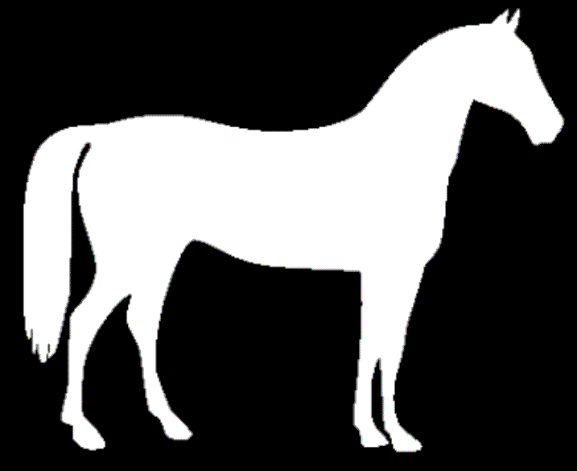

# Effects

   - None

     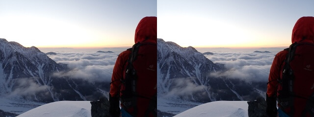

   - Binarise

     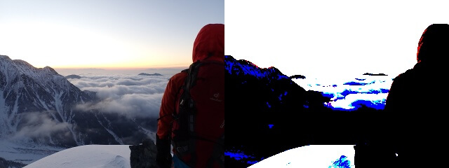

   - GreyScale

     

   - RGB2BGR

     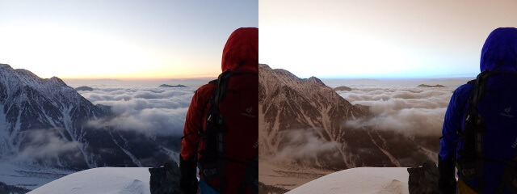

   - RedChannel

     

   - BlueChannel

     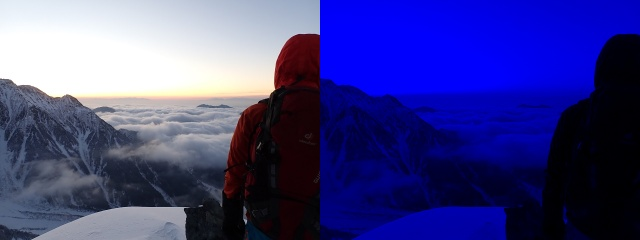

   - GreenChannel

     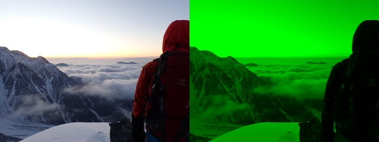

   - MostDominantColor

     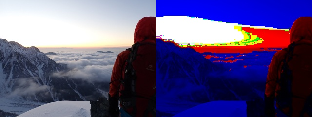

   - LeastDominantColor

     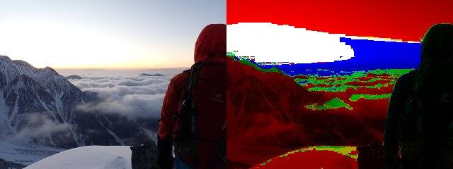

   - ScaleValues

     

   - ClipValues

     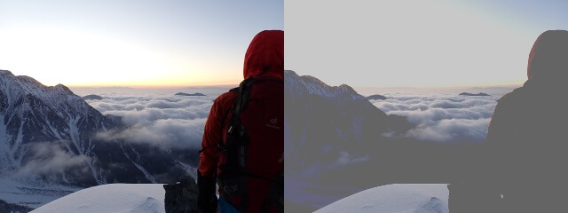

   - BinValues

     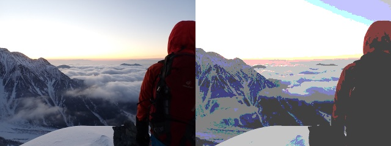

   - ResizeBlur

     

   - AddFrame

     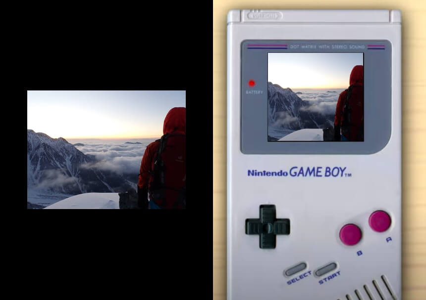

   - GaussianNoise

     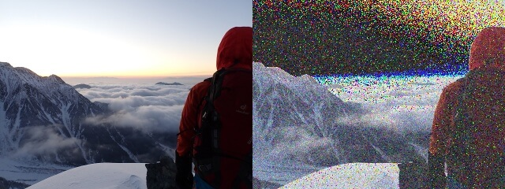

   - SpeckleNoise

     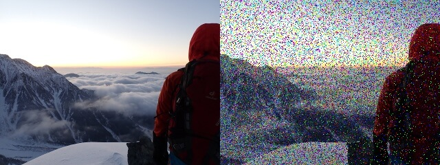

   - SaltPepperNoise

     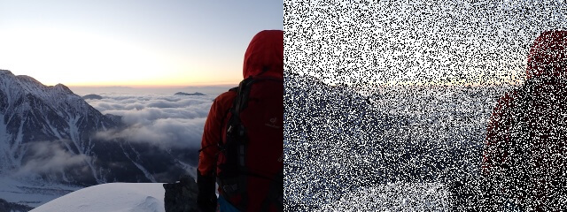

   - SemanticSegmentation

     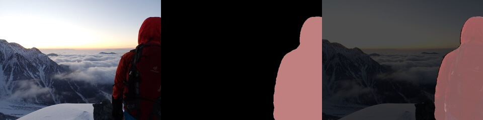

   - InstanceSegmentation

     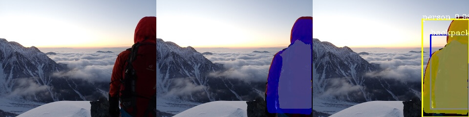

   - CannyEdges

     

   - ValueCount Plot

     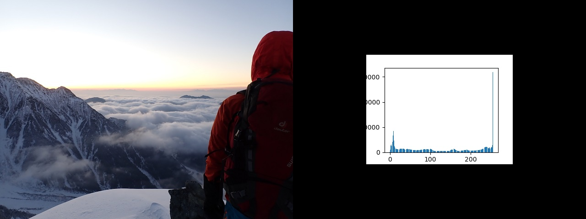

   - FrameDelay

     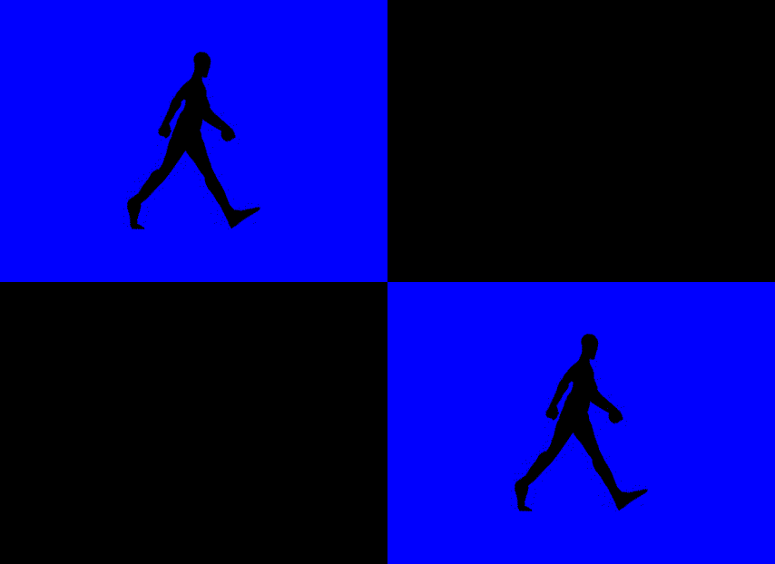

   - And many more! :O
   
     For full list of effects with their parameters see [Effect List](StreamLitGUI/Effects.txt).