# VidFX
 A python tool (UI and Code) for editing videos and adding fun effects to webcam and video

# GUI

 - GUI built using streamlit
 - To use app locally,
    - Clone the repo and run [StartUI.sh](StartUI.sh) to view the app on your browser!
 - App is also hosted remotely on heroku using my common host app,
    - [https://infinityjoker-apps.herokuapp.com/](https://infinityjoker-apps.herokuapp.com/)

    - In the Common Host App, simply choose a project to load and click load and deploy.

    - Then go ahead and use the app! :)

    - If you want to change to another app, simply click on View Other Projects in top left and choose any other project and load and deploy.

# UI Effects Visualiser
  
   
  View/Save effects easily for webcam or any video

  CommonEffects:
     
    Effects that are applied to Input Video before applying further effects

  EffectFuncs:

    - Effects applied for video to display

    - Multiple effect sequences are separated by a ',' line

    - Set of Sequences of effects are applied and all of them are appended as a single frame for an input frame from the video

  For full list of effects with their parameters see [Effect List](EffectsLibrary/Effects.txt)

  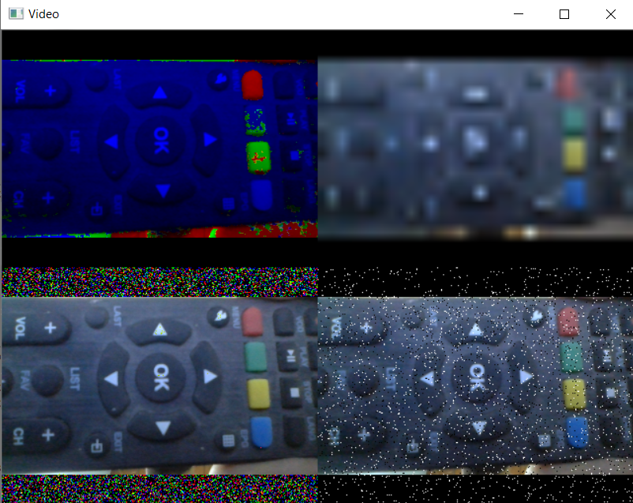

# Features

   - Add same effects for images

     
   
   - Effects can also be used in combination with each other (BinValues + Blur)

     

   - Multiple Effects can be viewed at same time

     
  
   - Effects Transistion can be applied to an image to form a video of the image under an effect with varying parameters (Decreasing Scale and Increasing Rotation)

     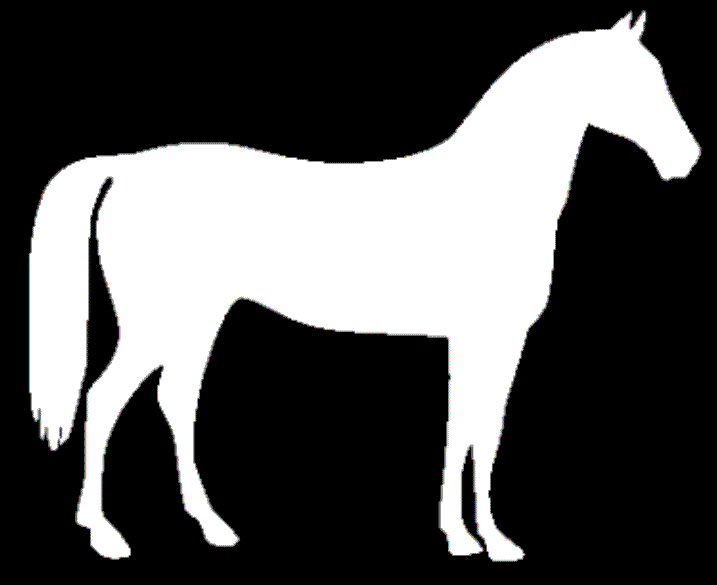

# Effects

   - None

     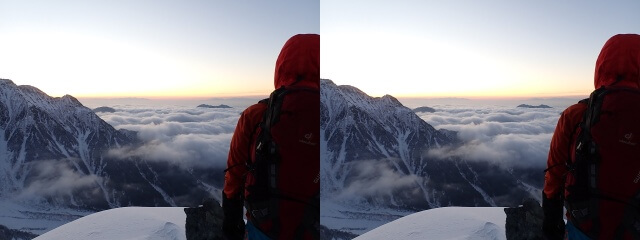

   - Binarise

     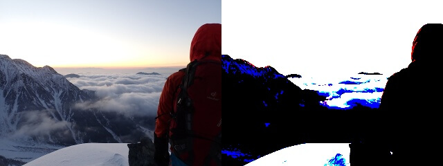

   - GreyScale

     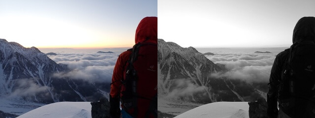

   - RGB2BGR

     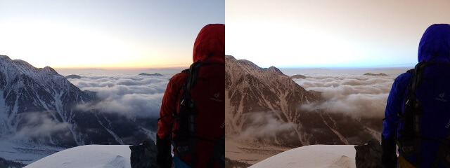

   - RedChannel

     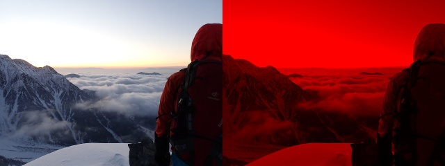

   - BlueChannel

     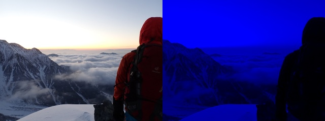

   - GreenChannel

     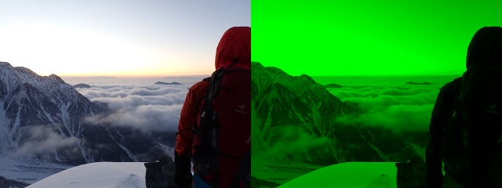

   - MostDominantColor

     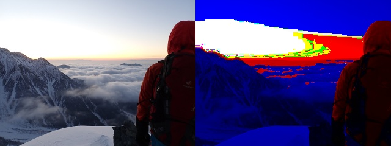

   - LeastDominantColor

     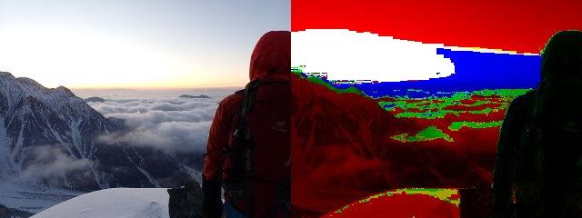

   - ScaleValues

     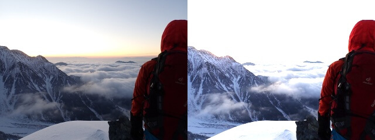

   - ClipValues

     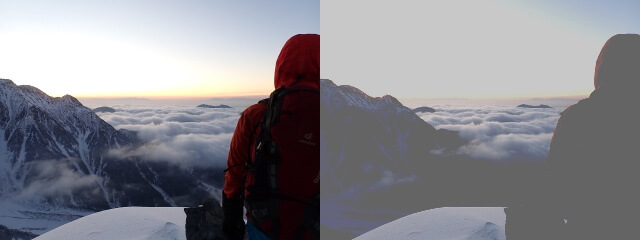

   - BinValues

     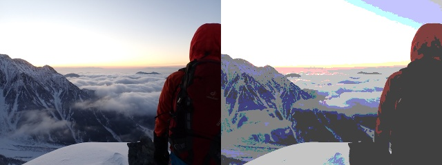

   - ResizeBlur

     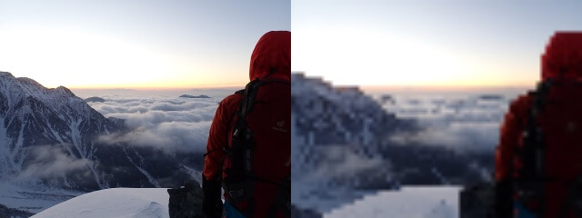

   - AddFrame

     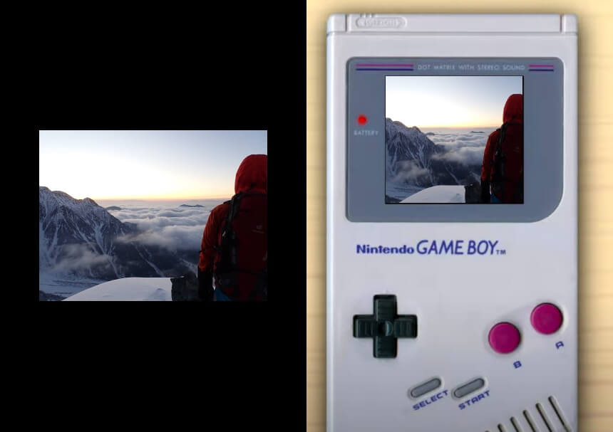

   - GaussianNoise

     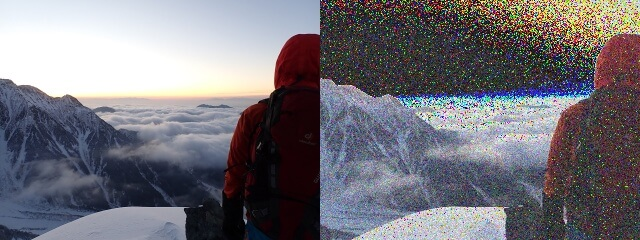

   - SpeckleNoise

     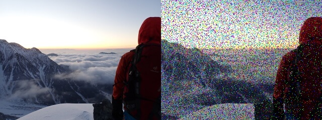

   - SaltPepperNoise

     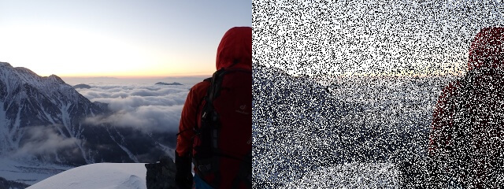

   - SemanticSegmentation

     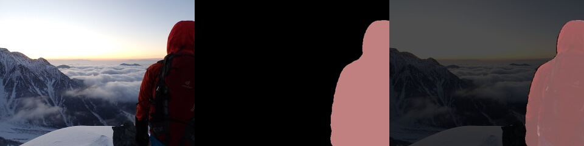

   - InstanceSegmentation

     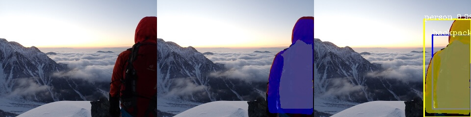

   - CannyEdges

     

   - ValueCount Plot

     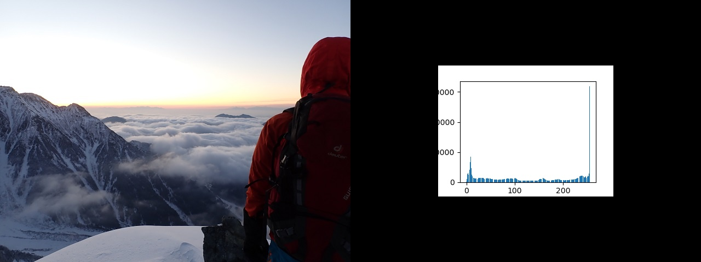

   - FrameDelay

     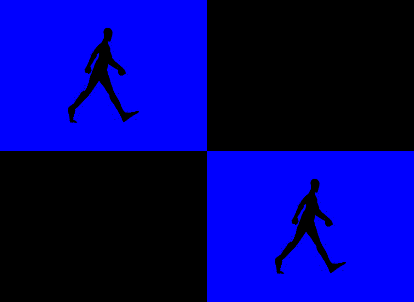

   - And many more! :O
   
     For full list of effects with their parameters see [Effect List](EffectsLibrary/Effects.txt).