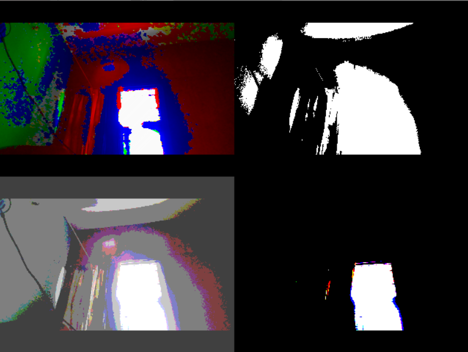

# VidFX
 A python tool for editing videos and adding fun effects

# Effects
   - Add Frames to webcam or any video

     

   - Many Fun Effects including greyscale, binarise, dominant and least dominant channel, etc
   
   - Effects can also be used in combination with each other

     

   - Multiple Effects can be viewed at same time

     
