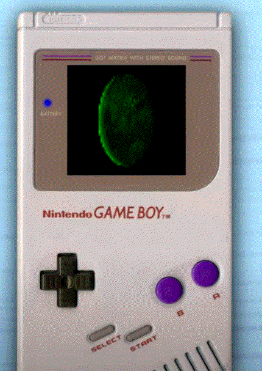
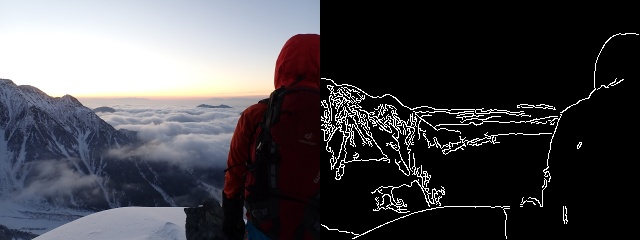

# VidFX
 A python tool (UI and Code) for editing videos and adding fun effects to webcam and video

# UI Effects Visualiser
   
   - Run VidFXUI.py file
   
     View effects easily for webcam or any video

     

     

# Features

   - Run FrameVid.py file
   
     Add Frames to webcam or any video

     

   - Many Fun Effects including greyscale, binarise, dominant and least dominant channel, etc
   
   - Effects can also be used in combination with each other

     

   - Multiple Effects can be viewed at same time

     

# Effects

   - None

     

   - Binarise

     

   - GreyScale

     

   - RGB2BGR

     

   - RedChannel

     

   - BlueChannel

     

   - GreenChannel

     

   - MostDominantColor

     

   - LeastDominantColor

     

   - ScaleValues

     

   - ClipValues

     

   - BinValues

     

   - ResizeBlur

     

   - AddFrame

     

   - GaussianNoise

     

   - SpeckleNoise

     

   - SaltPepperNoise

     

   - SemanticSegmentation

     

   - InstanceSegmentation

     

   - CannyEdges

     

   - And many more! 
   
     For full list of effects with their parameters see [Effect List](EffectsLibrary/Effects.txt).